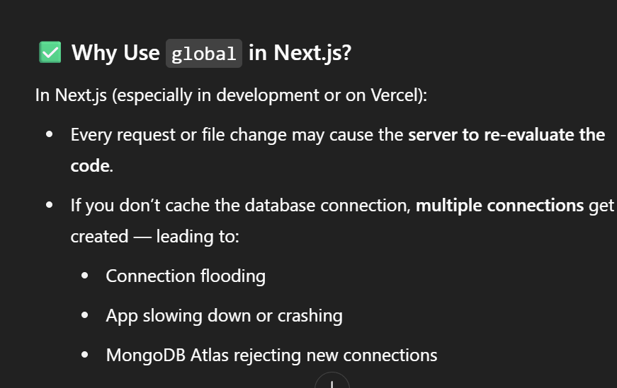

<!-- File1:.d.ts -->
Tanamay


| Concept               | Meaning                                                   |
| --------------------- | --------------------------------------------------------- |
| `declare global`      | You're adding a custom variable to the global object      |
| `mongoose.conn`       | The actual MongoDB connection (or `null`)                 |
| `mongoose.promise`    | A Promise that resolves to a MongoDB connection           |
| `Promise<Connection>` | A Promise that will eventually give you a `Connection`    |
| `export {}`           | Required to make this a module (scope the types properly) |





This line is needed to **mark the file as a module**, so that the `declare global` block is properly scoped and doesn’t pollute global types everywhere.

---

## 💡 Why This Pattern?

In Next.js (especially in development), your files are reloaded multiple times. If you don't cache your Mongo connection, you'll create **many duplicate connections**, leading to memory leaks and MongoDB errors.

So instead, you use this pattern:
```ts
if (!global.mongoose) {
  global.mongoose = { conn: null, promise: null };
}

// FILE:lib/db.ts
